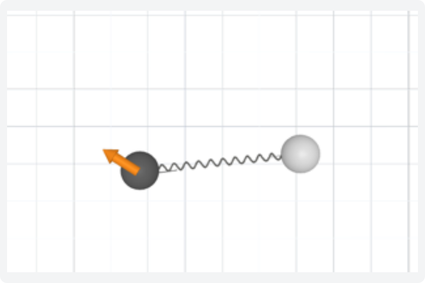
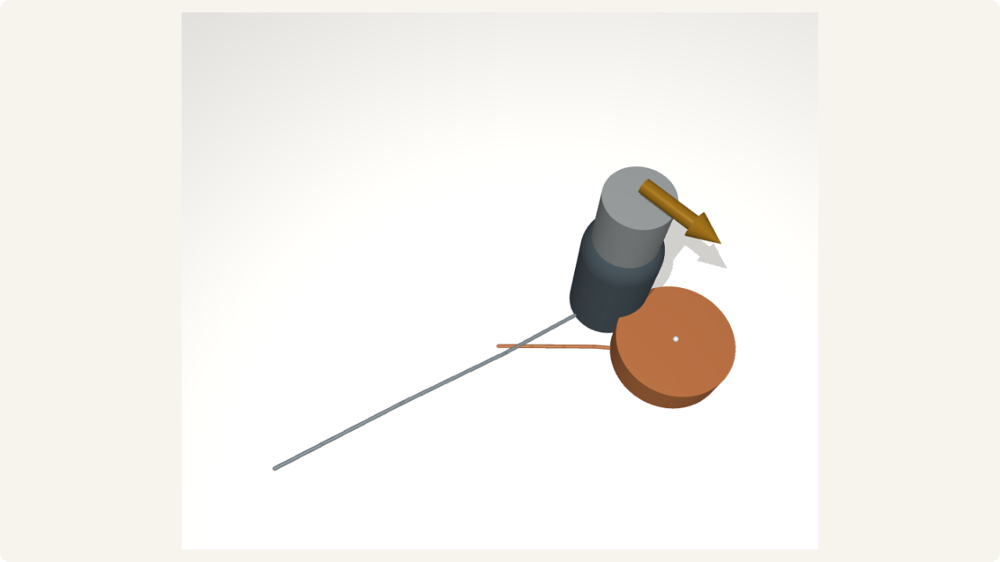
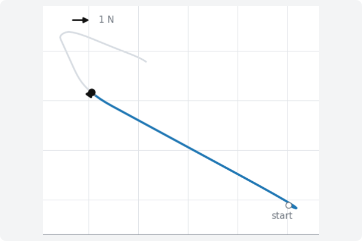
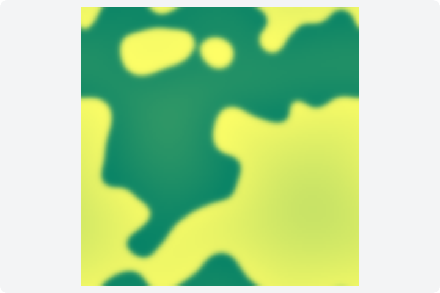
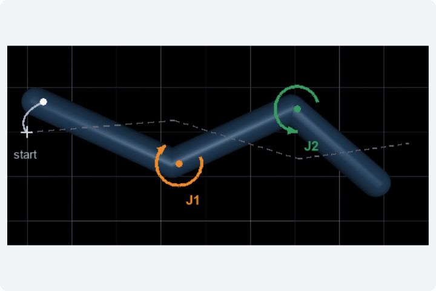
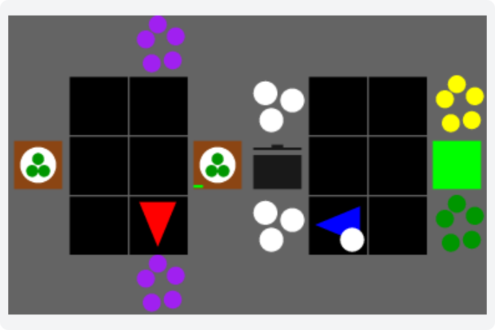
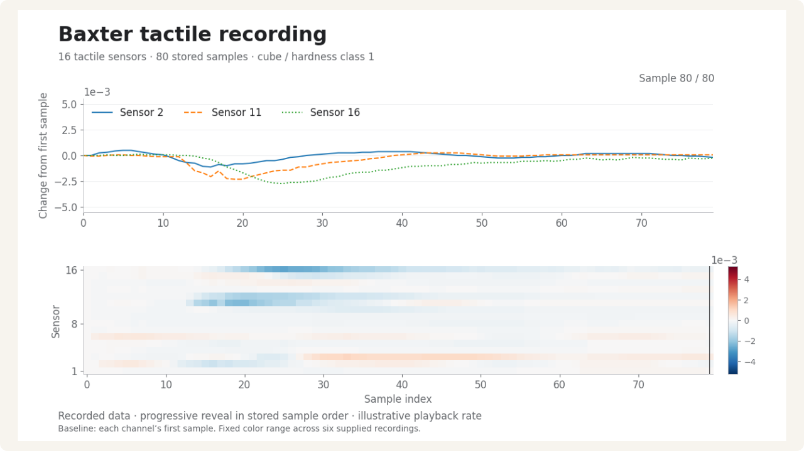
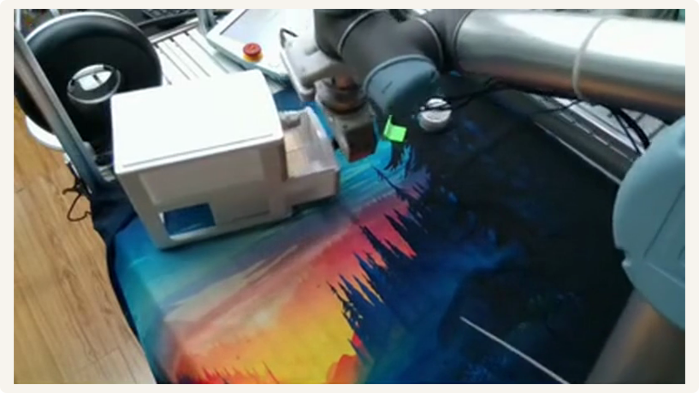

<p align="center"></p>

# Shaping Persistent Representations from Independent Interactions

**Ji Dai · Quan Fang · Junyu Gao · Rongfeng Guo · Haoyan Rong · Yiping Huang · Yongxi Li**

[Paper — latest PDF](https://jidaivita.github.io/sprii/SPRII.pdf) · [Project page](https://jidaivita.github.io/sprii/) · [Reviewer guide](docs/reviewer-guide.md) · [Reproduce](docs/reproduce.md) · [Citation](#citation)

SPRII uses relations between independent interactions to learn persistent context: information about a system that can be reused across changing states and actions. **Align** encourages contexts from related interactions to agree. **Cross** asks one interaction's context to help predict another's future. Both complement the learner's native prediction objective.

The experiments distinguish three questions: **Formation** — what persistent information can be read from the representation; **Use** — how that context changes a fixed predictor; and **Value** — when it improves a downstream task. The repository includes simulators, learner adaptations, physical-parameter probes, fixed-predictor interventions, and benchmark-specific training and evaluation programs.

## Get started

```sh
git clone https://github.com/jidaivita/SPRII.git
cd SPRII
python -m venv .venv
source .venv/bin/activate
python -m pip install -e .
python examples/dclean_pairs.py
```

On Windows, activate the environment with `.venv\Scripts\Activate.ps1`. The CPU example generates independent D-Clean interactions and checks disjoint system splits and wrong-relation controls. It is a small demonstration; paper experiments have their own budgets and inputs.

For learning, probes and implementation checks:

```sh
python -m pip install -e '.[train,dev]'
python examples/core_smoke.py
python -m pytest -q tests/core tests/formation_use
```

Start with the [reviewer guide](docs/reviewer-guide.md) to map paper questions to code and available checks, or the [reproduction guide](docs/reproduce.md) to run a selected benchmark. Some native integration tests need the source inputs in the [SpringWorld guide](benchmarks/springworld/README.md). Framework-specific dependencies and data are documented in each benchmark.

## Explore thirteen settings

Each row is one study setting; its name opens the corresponding project-page section.
Code links open the implementation and its guide;
data links lead to the relevant generator or input-preparation instructions.

| # | Setting | Code | Recipe | Data |
|---|---|---|---|---|
| 1 | [SpringWorld](https://jidaivita.github.io/sprii/#setting-spring) | [Source](benchmarks/formation_use/scripts/train_spring_source.py) · [Guide](benchmarks/springworld/README.md) | [Recipe](docs/paper_recipes.md#springworld) | [Inputs](benchmarks/springworld/README.md) |
| 2 | [PokeWorld](https://jidaivita.github.io/sprii/#setting-poke) | [Source](benchmarks/pokeworld/revision/scripts/train_pokeworld_revision.py) · [Guide](benchmarks/pokeworld/revision/README.md) | [Recipe](docs/paper_recipes.md#d-clean-and-pokeworld) | [Inputs](benchmarks/pokeworld/revision/scripts/prepare_pokeworld_factorized.py) |
| 3 | [D-Clean](https://jidaivita.github.io/sprii/#setting-dclean) | [Source](benchmarks/core/scripts/train.py) · [Guide](benchmarks/core/README.md) | [Recipe](docs/paper_recipes.md#d-clean-and-pokeworld) | [Inputs](benchmarks/core/scripts/generate_dclean.py) |
| 4 | [CoPhy Collision](https://jidaivita.github.io/sprii/#setting-cophy_collision) | [Source](benchmarks/cophy/code/cophy_complete_v7/cpc/train.py) · [Guide](benchmarks/cophy/README.md) | [Recipe](docs/paper_recipes.md#cophy-balls-collision-and-blocktower) | [Inputs](docs/datasets.md#cophy) |
| 5 | [CoPhy Balls](https://jidaivita.github.io/sprii/#setting-cophy_balls) | [Source](benchmarks/cophy/code/cophy_complete_v7/rssm/train.py) · [Guide](benchmarks/cophy/README.md) | [Recipe](docs/paper_recipes.md#cophy-balls-collision-and-blocktower) | [Inputs](docs/datasets.md#cophy) |
| 6 | [CoPhy Blocktower](https://jidaivita.github.io/sprii/#setting-cophy_blocktower) | [Source](benchmarks/cophy/code/cophy_complete_v7/cpc/train.py) · [Guide](benchmarks/cophy/README.md) | [Recipe](docs/paper_recipes.md#cophy-balls-collision-and-blocktower) | [Inputs](docs/datasets.md#cophy) |
| 7 | [Burgers](https://jidaivita.github.io/sprii/#setting-nod1d) | [Source](benchmarks/nod/src/nod_sprii/train_sprii_clean.py) · [Guide](benchmarks/nod/README.md) | [Recipe](docs/paper_recipes.md#nod-burgers-and-fhn) | [Inputs](benchmarks/nod/README.md#dependencies-and-public-inputs) |
| 8 | [FHN](https://jidaivita.github.io/sprii/#setting-nod2d) | [Source](benchmarks/nod/src/fhn_minimal/train.py) · [Guide](benchmarks/nod/README.md) | [Recipe](docs/paper_recipes.md#nod-burgers-and-fhn) | [Inputs](benchmarks/nod/README.md#generate-the-fhn-data) |
| 9 | [Swimmer](https://jidaivita.github.io/sprii/#setting-swimmer) | [Source](benchmarks/swimmer/code/paper_c/swimmer/s2_train.py) · [Guide](benchmarks/swimmer/README.md) | [Recipe](docs/paper_recipes.md#overcookedv2-articulated-swimmer-and-pendulum) | [Inputs](benchmarks/swimmer/README.md#entry-points) |
| 10 | [Overcooked](https://jidaivita.github.io/sprii/#setting-overcooked) | [Source](benchmarks/overcooked/scripts/train.py) · [Guide](benchmarks/overcooked/README.md) | [Recipe](docs/paper_recipes.md#overcookedv2-articulated-swimmer-and-pendulum) | [Inputs](benchmarks/overcooked/README.md#reconstruct-the-data-and-train) |
| 11 | [Baxter](https://jidaivita.github.io/sprii/#setting-baxter) | [Source](benchmarks/core/scripts/train_baxter_a1.py) · [Guide](docs/datasets.md) | [Recipe](docs/paper_recipes.md#baxter-tactile-and-rh20t) | [Inputs](docs/datasets.md#baxter-tactile-hardness) |
| 12 | [RH20T](https://jidaivita.github.io/sprii/#setting-rh20t) | [Source](benchmarks/core/scripts/train_rh20t.py) · [Guide](benchmarks/rh20t/README.md) | [Recipe](docs/paper_recipes.md#baxter-tactile-and-rh20t) | [Inputs](docs/datasets.md#rh20t) |
| 13 | [Pendulum](https://jidaivita.github.io/sprii/#setting-pendulum) | [Source](benchmarks/baseline_adapters/cadm_pendulum_relation_components_v5.py) · [Guide](benchmarks/baseline_adapters/README.md#pendulum) | [Recipe](docs/paper_recipes.md#overcookedv2-articulated-swimmer-and-pendulum) | [Inputs](benchmarks/baseline_adapters/README.md#pendulum) |

CoPhy Collision, Balls, and Blocktower are separate settings with shared
scene-selecting training entry points. Burgers and FHN, and Baxter and RH20T,
are listed separately even where they share a guide.

<details>
<summary>Environment previews — 10 images</summary>

These previews illustrate the environments. The three CoPhy settings have
text-only implementation entries in the complete index above.

<table>
<tr>
<td width="50%" align="center" valign="top"><a href="assets/environments/springworld.png"></a><br/><a href="benchmarks/springworld/README.md">SpringWorld</a></td>
<td width="50%" align="center" valign="top"><a href="assets/environments/pokeworld.png"></a><br/><a href="benchmarks/pokeworld/revision/README.md">PokeWorld</a></td>
</tr>
<tr>
<td width="50%" align="center" valign="top"><a href="assets/environments/dclean.png"></a><br/><a href="benchmarks/core/README.md">D-Clean</a></td>
<td width="50%" align="center" valign="top"><a href="assets/environments/burgers.png"></a><br/><a href="benchmarks/nod/README.md">Burgers</a></td>
</tr>
<tr>
<td width="50%" align="center" valign="top"><a href="assets/environments/fhn.png"></a><br/><a href="benchmarks/nod/README.md">FHN</a></td>
<td width="50%" align="center" valign="top"><a href="assets/environments/swimmer.png"></a><br/><a href="benchmarks/swimmer/README.md">Swimmer</a></td>
</tr>
<tr>
<td width="50%" align="center" valign="top"><a href="assets/environments/overcooked.png"></a><br/><a href="benchmarks/overcooked/README.md">Overcooked</a></td>
<td width="50%" align="center" valign="top"><a href="assets/environments/baxter.png"></a><br/><a href="docs/datasets.md">Baxter</a></td>
</tr>
<tr>
<td width="50%" align="center" valign="top"><a href="assets/environments/rh20t.png"></a><br/><a href="benchmarks/rh20t/README.md">RH20T</a></td>
<td width="50%" align="center" valign="top"><a href="assets/environments/pendulum.png"></a><br/><a href="benchmarks/baseline_adapters/README.md#pendulum">Pendulum</a></td>
</tr>
</table>

See [gallery notes](docs/gallery.md) and [media credits](docs/media-credits.md).

</details>

## Baselines and protocols

The thirteen-setting index above is the environment inventory. Additional learner
comparisons are documented in [CaDM, GEPS, and CoDA adapters](benchmarks/baseline_adapters/README.md)
and [DALI/FCRL adaptations](benchmarks/additional_baselines/README.md).

For the scientific choices, see [protocols](docs/protocols.md),
[paper recipes](docs/paper_recipes.md), [hyperparameters](docs/hyperparameters.md),
and [interfaces](docs/interfaces.md). Separate source snapshots preserve the
import layouts used by their experiments; the benchmark guides identify the
appropriate entry points.

## Release scope

Public source version **0.2.0** supports the [SPRII author manuscript](https://jidaivita.github.io/sprii/SPRII.pdf). It builds on the verified 0.1.2 source snapshot with public documentation, citation metadata, and stable project links. Training code, experimental configurations, and scientific results are unchanged by this publication update. The gallery keeps CoPhy as text-only implementation links.

The package contains code, configuration, tests, and source provenance. Generated simulation data can be recreated with the included generators. External datasets and dependencies are acquired through their official sources; trained checkpoints and historical training logs are not bundled. Some frozen-checkpoint analyses require those separately specified inputs. The [reproduction guide](docs/reproduce.md) explains this scope, and [verification](docs/verification.md) records the checks actually performed. The recipe document identifies its manuscript snapshot; this release does not claim a new rerun or a complete audit of every number in a later manuscript revision.

## Repository layout

```text
src/            Models, objectives, simulators and readers
benchmarks/     Environment-specific implementations and guides
experiments/    Preserved source and evaluation snapshots
configs/        Core defaults and protocol configuration
docs/           Reproduction, interfaces, protocols and verification
examples/       Small runnable demonstrations
tests/          Implementation and protocol checks
scripts/        Dependency preparation and release verification
third_party/    Pinned external sources and license notices
assets/         Project wordmark and environment previews
releases/       Source-file integrity manifest
```

## Citation

```bibtex
@misc{dai2026sprii,
  title   = {Shaping Persistent Representations from Independent Interactions},
  author  = {Dai, Ji and Fang, Quan and Gao, Junyu and Guo, Rongfeng and Rong, Haoyan and Huang, Yiping and Li, Yongxi},
  year    = {2026},
  note    = {Author manuscript, October 2026},
  url     = {https://jidaivita.github.io/sprii/SPRII.pdf}
}
```

Machine-readable citation metadata is available in [CITATION.cff](CITATION.cff).

## License

Original contributions are provided under the [MIT license](LICENSE), with component-specific exceptions. CoPhy-derived code retains GPL-3.0, persistbench retains Apache-2.0, and NOD-derived components retain their documented upstream terms. See [third-party notices](THIRD_PARTY_NOTICES.md) and [media credits](docs/media-credits.md) for the corresponding attribution, dependencies, and media terms.
